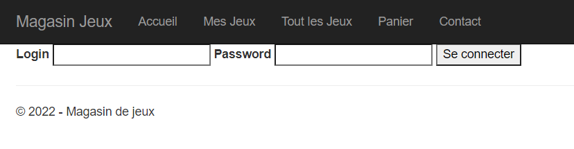
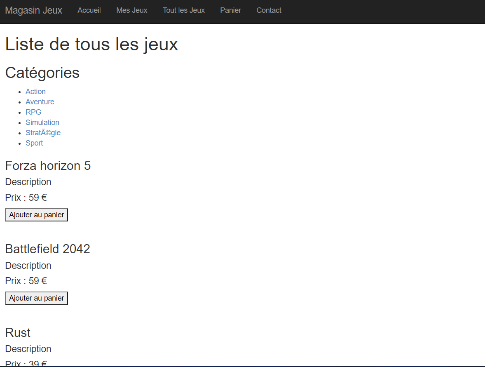
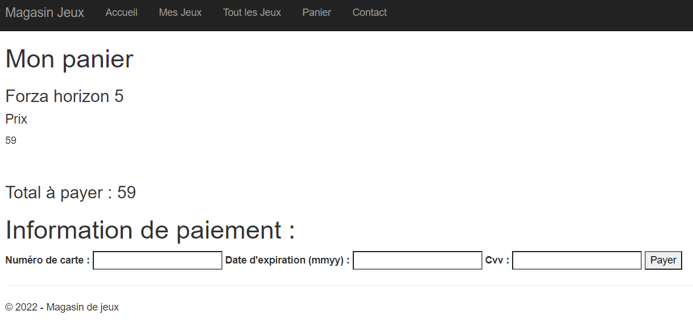

GALLET Benjamin
KITSCHMYOF Stephan

# TPINFO910
Projet correspondant au TP d'INFO910 - DevOps

# Sujet
Nous avons choisi de réaliser un site de vente.
Quand nous arrivons sur la page d'accueil, il faut se connecter :

 
```
Combinaisons login - mot de passe valides
log1 - pass1
log2 - pass2
log3 - pass3
log4 - pass4
```
L'utilisateur peut ensuite regarder les différents jeux en vente sur le site :



L'utilisateur peut ajouter des jeux à son panier et les payer :



```
Numéros de cartes valides :
1234123412341234
5678567856785678
9999999999999999

La date d'expiration et le cryptogramme visuel ne sont pas pris en compte lors du paiement.
```

# Architecture du projet
- api
- appSources
    - static
    - templates
    - \_\_init\_\_.py
- bdd
- images
- kubernetes
- compose.yaml
- Dockerfile
- requirements.txt
- server.py 

# Les containers
## Serveur web
La première partie de notre application est la partie web. Nous avons choisi de développer le site avec le framework Flask qui permet le développement de sites web en python.

Pour créer ce container, nous avons pris pour base l'image officielle python à laquelle nous avons fait exécuter la commande pour installer les packages nécessaires pour flask.

Nous copions ensuite nos sources dans le répertoire app de notre container.

Enfin, nous lançons la commande pour démarrer notre serveur flask.

### Docker File
```docker
FROM python:latest

WORKDIR /app

COPY . /app
RUN pip3 install -r requirements.txt

CMD ["python3","runserver.py"]
```
## API
Pour simuler les paiements sur le site, nous avons créé une api qui va stocker des cartes et simuler un paiement quand nous allons l'appeler. 

### Requête
Pour effectuer une transaction avec une carte, nous utilisons la route **/makeOperation**. 

Nous transmettons aussi :
- le numéro de la carte : pour que notre api sache si la carte est valide ou non
- le montant de la transaction : l'api va alors retrancher ce montant du solde de la carte. Si le solde n'est pas négatif alors la tranction sera renvoyée comme valide.
```bash
$curl --location --request POST 'localhost:8080/makeOperation' \
--header 'Content-Type: application/json' \
--data-raw '{
    "numero":"1234123412341234",
    "montant":100
}'
```
### Réponse
```json
{
  "status":"valide"
}
```
### Docker File
Pour cette api, nous avons choisi le package node express.

Nous nous basons sur une version node-14 alpine pour que la taille de l'image de notre container soit la plus réduite possible.

Nous installons ensuite les dépendances puis nous lançons la commande qui permet de démarrer notre serveur express.
```dockerfile
FROM node:14-alpine

WORKDIR /app

COPY . /app/

RUN npm install

EXPOSE 8080

CMD ["node","serveur.js"]
```
## Base de données
Nous avons une base mysql qui va se construire à son premier lancement via un fichier sql disponible dans le dossier bdd du projet.

# Configuration pour Docker
Afin d'orchestrer ces 3 containers, nous avons fait un fichier docker-compose.
Il est composé de 3 services qui correspondent à nos 3 containers.

Pour chacun des containers, nous allons spécifier l'emplacement de leur image ou comment les builder quand cela est possible.

Nous allons aussi faire un binding de port entre notre réseau et le réseau des containers.

Nous allons aussi préciser pour la base de données, la méthode d'authentification ainsi que le fichier qui doit l'initialiser.

## Docker compose
```yaml
version: "3.9"

services:
  api:
    build: ./api
    image: ghcr.io/benjaminglt1/tpinfo910_api:latest
    restart: always
    ports:
      - ${API_PORT}:8080
  db:
    image: mysql
    command: --default-authentication-plugin=mysql_native_password
    restart: always
    volumes:
      - "./bdd/bdd_finale.sql:/docker-entrypoint-initdb.d/bdd_finale.sql"
    environment:
      MYSQL_ROOT_PASSWORD: "root"

  flaskserver:
    build: .
    image: ghcr.io/benjaminglt1/tpinfo910_frontend:latest
    restart: always
    ports:
      - ${APP_PORT}:3333
    volumes:
      - ${APP_SOURCES}:/app/appSources
    depends_on:
      - db

networks:
  demonet:
```

# Configuration pour Kubernetes

## Utilisation du registry github
Pour utiliser ce registry, il faut :
- S'identifier à l'aide de son compte
```bash
#Exemple
docker login ghcr.io -u USERNAME --password-stdin
```
- Construire l'image de notre application localement
```bash
#Exemple
docker build -t ghcr.io/benjaminglt1/tpinfo910_frontend:latest .
```
- Envoyer cette image sur le registry
```bash
#Exemple
docker push ghcr.io/benjaminglt1/tpinfo910_frontend:latest 
```

Une fois ces trois étapes effectuées, nous pouvons utiliser nos images et les télécharger.
## Fichiers Kubernetes
### Base de données
```yaml
apiVersion: v1
data:
  init-db.sql: | 
    SET @OLD_UNIQUE_CHECKS=@@UNIQUE_CHECKS, UNIQUE_CHECKS=0;
    SET @OLD_FOREIGN_KEY_CHECKS=@@FOREIGN_KEY_CHECKS, FOREIGN_KEY_CHECKS=0;
    SET @OLD_SQL_MODE=@@SQL_MODE, SQL_MODE='ONLY_FULL_GROUP_BY,STRICT_TRANS_TABLES,NO_ZERO_IN_DATE,NO_ZERO_DATE,ERROR_FOR_DIVISION_BY_ZERO,NO_ENGINE_SUBSTITUTION';

    -- -----------------------------------------------------
    -- Schema INFO910
    -- -----------------------------------------------------
    CREATE SCHEMA IF NOT EXISTS `INFO910` DEFAULT CHARACTER SET utf8 ;
    USE `INFO910` ;

    -- -----------------------------------------------------
    -- Table `INFO910`.`Utilisateur`
    -- -----------------------------------------------------
    CREATE TABLE IF NOT EXISTS `INFO910`.`Utilisateur` (
      `Id` INT NOT NULL AUTO_INCREMENT,
      `Nom` VARCHAR(45) NOT NULL DEFAULT 'User',
      `Prenom` VARCHAR(45) NOT NULL DEFAULT 'User',
      `Telephone` VARCHAR(255) NOT NULL,
      `Email` VARCHAR(45) NOT NULL,
      `Login` VARCHAR(255) NOT NULL,
      `Password` VARCHAR(255) NOT NULL,
      PRIMARY KEY (`Id`),
      UNIQUE INDEX `Id_UNIQUE` (`Id` ASC) ,
      UNIQUE INDEX `Login_UNIQUE` (`Login` ASC) )
    ENGINE = InnoDB;


    -- -----------------------------------------------------
    -- Table `INFO910`.`Editeur`
    -- -----------------------------------------------------
    CREATE TABLE IF NOT EXISTS `INFO910`.`Editeur` (
      `Id` INT NOT NULL AUTO_INCREMENT,
      `Nom` VARCHAR(255) NOT NULL,
      PRIMARY KEY (`Id`),
      UNIQUE INDEX `Id_UNIQUE` (`Id` ASC) ,
      UNIQUE INDEX `Nom_UNIQUE` (`Nom` ASC) )
    ENGINE = InnoDB;


    -- -----------------------------------------------------
    -- Table `INFO910`.`Categorie`
    -- -----------------------------------------------------
    CREATE TABLE IF NOT EXISTS `INFO910`.`Categorie` (
      `Id` INT NOT NULL AUTO_INCREMENT,
      `Nom` VARCHAR(45) NOT NULL,
      PRIMARY KEY (`Id`),
      UNIQUE INDEX `Id_UNIQUE` (`Id` ASC) )
    ENGINE = InnoDB;


    -- -----------------------------------------------------
    -- Table `INFO910`.`Jeu`
    -- -----------------------------------------------------
    CREATE TABLE IF NOT EXISTS `INFO910`.`Jeu` (
      `Id` INT NOT NULL AUTO_INCREMENT,
      `Nom` VARCHAR(45) NOT NULL,
      `Description` VARCHAR(255) NOT NULL,
      `Prix` INT NOT NULL,
      `IdEditeur` INT NOT NULL,
      `IdCategorie` INT NOT NULL,
      PRIMARY KEY (`Id`),
      UNIQUE INDEX `Id_UNIQUE` (`Id` ASC) ,
      UNIQUE INDEX `Nom_UNIQUE` (`Nom` ASC) ,
      INDEX `editeur_idx` (`IdEditeur` ASC) ,
      INDEX `categorie_idx` (`IdCategorie` ASC) ,
      CONSTRAINT `editeur_jeu`
        FOREIGN KEY (`IdEditeur`)
        REFERENCES `INFO910`.`Editeur` (`Id`)
        ON DELETE NO ACTION
        ON UPDATE NO ACTION,
      CONSTRAINT `categorie_jeu`
        FOREIGN KEY (`IdCategorie`)
        REFERENCES `INFO910`.`Categorie` (`Id`)
        ON DELETE NO ACTION
        ON UPDATE NO ACTION)
    ENGINE = InnoDB;


    -- -----------------------------------------------------
    -- Table `INFO910`.`Evaluation`
    -- -----------------------------------------------------
    CREATE TABLE IF NOT EXISTS `INFO910`.`Evaluation` (
      `Id` INT NOT NULL AUTO_INCREMENT,
      `Note` VARCHAR(1) NOT NULL DEFAULT '5',
      `IdJeu` INT NOT NULL,
      `IdUtilisateur` INT NOT NULL,
      PRIMARY KEY (`Id`),
      UNIQUE INDEX `Id_UNIQUE` (`Id` ASC) ,
      INDEX `utilisateur_idx` (`IdUtilisateur` ASC) ,
      INDEX `jeu_idx` (`IdJeu` ASC) ,
      CONSTRAINT `utilisateur_evaluation`
        FOREIGN KEY (`IdUtilisateur`)
        REFERENCES `INFO910`.`Utilisateur` (`Id`)
        ON DELETE NO ACTION
        ON UPDATE NO ACTION,
      CONSTRAINT `jeu_evaluation`
        FOREIGN KEY (`IdJeu`)
        REFERENCES `INFO910`.`Jeu` (`Id`)
        ON DELETE NO ACTION
        ON UPDATE NO ACTION)
    ENGINE = InnoDB;


    -- -----------------------------------------------------
    -- Table `INFO910`.`Panier`
    -- -----------------------------------------------------
    CREATE TABLE IF NOT EXISTS `INFO910`.`Panier` (
      `Id` INT NOT NULL AUTO_INCREMENT,
      `IdUtilisateur` INT NOT NULL,
      PRIMARY KEY (`Id`),
      UNIQUE INDEX `Id_UNIQUE` (`Id` ASC) ,
      INDEX `utilisateur_idx` (`IdUtilisateur` ASC) ,
      CONSTRAINT `utilisateur_panier`
        FOREIGN KEY (`IdUtilisateur`)
        REFERENCES `INFO910`.`Utilisateur` (`Id`)
        ON DELETE NO ACTION
        ON UPDATE NO ACTION)
    ENGINE = InnoDB;


    -- -----------------------------------------------------
    -- Table `INFO910`.`Panier_Utilisateur`
    -- -----------------------------------------------------
    CREATE TABLE IF NOT EXISTS `INFO910`.`Panier_Utilisateur` (
      `Id` INT NOT NULL AUTO_INCREMENT,
      `IdPanier` INT NOT NULL,
      `IdJeu` INT NOT NULL,
      PRIMARY KEY (`Id`),
      UNIQUE INDEX `Id_UNIQUE` (`Id` ASC) ,
      INDEX `jeu_idx` (`IdJeu` ASC) ,
      INDEX `panier_idx` (`IdPanier` ASC) ,
      CONSTRAINT `jeu_panier_utilisateur`
        FOREIGN KEY (`IdJeu`)
        REFERENCES `INFO910`.`Jeu` (`Id`)
        ON DELETE NO ACTION
        ON UPDATE NO ACTION,
      CONSTRAINT `panier_panier_utilisateur`
        FOREIGN KEY (`IdPanier`)
        REFERENCES `INFO910`.`Panier` (`Id`)
        ON DELETE NO ACTION
        ON UPDATE NO ACTION)
    ENGINE = InnoDB;


    -- -----------------------------------------------------
    -- Table `INFO910`.`Jeux_Utilisateur`
    -- -----------------------------------------------------
    CREATE TABLE IF NOT EXISTS `INFO910`.`Jeux_Utilisateur` (
      `IdUtilisateur` INT NOT NULL,
      `IdJeu` INT NOT NULL,
      INDEX `utilisateur_idx` (`IdUtilisateur` ASC) ,
      INDEX `jeu_idx` (`IdJeu` ASC) ,
      CONSTRAINT `utilisateur_jeux_utilisateur`
        FOREIGN KEY (`IdUtilisateur`)
        REFERENCES `INFO910`.`Utilisateur` (`Id`)
        ON DELETE NO ACTION
        ON UPDATE NO ACTION,
      CONSTRAINT `jeu_jeux_utilisateur`
        FOREIGN KEY (`IdJeu`)
        REFERENCES `INFO910`.`Jeu` (`Id`)
        ON DELETE NO ACTION
        ON UPDATE NO ACTION)
    ENGINE = InnoDB;


    -- -----------------------------------------------------
    -- Table `INFO910`.`Carte`
    -- -----------------------------------------------------
    CREATE TABLE IF NOT EXISTS `INFO910`.`Carte` (
      `Id` INT NOT NULL AUTO_INCREMENT,
      `Numero` VARCHAR(16) NOT NULL,
      `DateExp` VARCHAR(4) NOT NULL,
      `Cvv` VARCHAR(3) NOT NULL,
      PRIMARY KEY (`Id`),
      UNIQUE INDEX `Id_UNIQUE` (`Id` ASC) )
    ENGINE = InnoDB;


    -- -----------------------------------------------------
    -- Table `INFO910`.`Utilisateur_Cartes`
    -- -----------------------------------------------------
    CREATE TABLE IF NOT EXISTS `INFO910`.`Utilisateur_Cartes` (
      `IdUtilisateur` INT NOT NULL,
      `IdCarte` INT NOT NULL,
      INDEX `utilisateur_idx` (`IdUtilisateur` ASC) ,
      INDEX `carte_idx` (`IdCarte` ASC) ,
      CONSTRAINT `utilisateur_utilisateur_cartes`
        FOREIGN KEY (`IdUtilisateur`)
        REFERENCES `INFO910`.`Utilisateur` (`Id`)
        ON DELETE NO ACTION
        ON UPDATE NO ACTION,
      CONSTRAINT `carte_utilisateur_cartes`
        FOREIGN KEY (`IdCarte`)
        REFERENCES `INFO910`.`Carte` (`Id`)
        ON DELETE NO ACTION
        ON UPDATE NO ACTION)
    ENGINE = InnoDB;


    -- -----------------------------------------------------
    -- Table `INFO910`.`Commentaire`
    -- -----------------------------------------------------
    CREATE TABLE IF NOT EXISTS `INFO910`.`Commentaire` (
      `Id` INT NOT NULL AUTO_INCREMENT,
      `Titre` VARCHAR(45) NOT NULL,
      `Description` VARCHAR(255) NOT NULL,
      `IdUtilisateur` INT NOT NULL,
      `IdJeu` INT NOT NULL,
      UNIQUE INDEX `Id_UNIQUE` (`Id` ASC) ,
      PRIMARY KEY (`Id`),
      INDEX `utilisateur_idx` (`IdUtilisateur` ASC) ,
      INDEX `jeu_idx` (`IdJeu` ASC) ,
      CONSTRAINT `utilisateur_commentaire`
        FOREIGN KEY (`IdUtilisateur`)
        REFERENCES `INFO910`.`Utilisateur` (`Id`)
        ON DELETE NO ACTION
        ON UPDATE NO ACTION,
      CONSTRAINT `jeu_commentaire`
        FOREIGN KEY (`IdJeu`)
        REFERENCES `INFO910`.`Jeu` (`Id`)
        ON DELETE NO ACTION
        ON UPDATE NO ACTION)
    ENGINE = InnoDB;


    SET SQL_MODE=@OLD_SQL_MODE;
    SET FOREIGN_KEY_CHECKS=@OLD_FOREIGN_KEY_CHECKS;
    SET UNIQUE_CHECKS=@OLD_UNIQUE_CHECKS;

    -- -----------------------------------------------------
    -- Insertion de données Categorie
    -- -----------------------------------------------------
    INSERT INTO Categorie(Id,Nom) VALUES (NULL,"Action");
    INSERT INTO Categorie(Id,Nom) VALUES (NULL,"Aventure");
    INSERT INTO Categorie(Id,Nom) VALUES (NULL,"RPG");
    INSERT INTO Categorie(Id,Nom) VALUES (NULL,"Simulation");
    INSERT INTO Categorie(Id,Nom) VALUES (NULL,"Stratégie");
    INSERT INTO Categorie(Id,Nom) VALUES (NULL,"Sport");

    -- -----------------------------------------------------
    -- Insertion de données Editeur
    -- -----------------------------------------------------
    INSERT INTO Editeur(Id,Nom) VALUES (NULL,"Playground Games");
    INSERT INTO Editeur(Id,Nom) VALUES (NULL,"DICE");
    INSERT INTO Editeur(Id,Nom) VALUES (NULL,"Facepunch Studios");
    INSERT INTO Editeur(Id,Nom) VALUES (NULL,"IO Interactive A/S");
    INSERT INTO Editeur(Id,Nom) VALUES (NULL,"Rockstar Games");
    INSERT INTO Editeur(Id,Nom) VALUES (NULL,"Endnight Games Ltd");
    INSERT INTO Editeur(Id,Nom) VALUES (NULL,"Valve");
    INSERT INTO Editeur(Id,Nom) VALUES (NULL,"ConcernedApe");
    INSERT INTO Editeur(Id,Nom) VALUES (NULL,"Ubisoft Montreal");
    INSERT INTO Editeur(Id,Nom) VALUES (NULL,"Bethesda");

    -- -----------------------------------------------------
    -- Insertion de données Jeu
    -- -----------------------------------------------------
    INSERT INTO Jeu(Id,Nom,Description,Prix,IdEditeur,IdCategorie) VALUES (NULL,"Forza horizon 5","",59,1,6);
    INSERT INTO Jeu(Id,Nom,Description,Prix,IdEditeur,IdCategorie) VALUES (NULL,"Battlefield 2042","",59,2,1);
    INSERT INTO Jeu(Id,Nom,Description,Prix,IdEditeur,IdCategorie) VALUES (NULL,"Rust","",39,3,2);
    INSERT INTO Jeu(Id,Nom,Description,Prix,IdEditeur,IdCategorie) VALUES (NULL,"Hitman","",59,4,4);
    INSERT INTO Jeu(Id,Nom,Description,Prix,IdEditeur,IdCategorie) VALUES (NULL,"Red dead redemption","",59,5,1);
    INSERT INTO Jeu(Id,Nom,Description,Prix,IdEditeur,IdCategorie) VALUES (NULL,"The forest","",16,6,2);
    INSERT INTO Jeu(Id,Nom,Description,Prix,IdEditeur,IdCategorie) VALUES (NULL,"CS:GO","",0,7,1);
    INSERT INTO Jeu(Id,Nom,Description,Prix,IdEditeur,IdCategorie) VALUES (NULL,"Stardew Valley","",13,8,4);
    INSERT INTO Jeu(Id,Nom,Description,Prix,IdEditeur,IdCategorie) VALUES (NULL,"Far cry 3","",19,9,1);
    INSERT INTO Jeu(Id,Nom,Description,Prix,IdEditeur,IdCategorie) VALUES (NULL,"Fallout 4","",19,10,3);

    -- -----------------------------------------------------
    -- Insertion de données Carte
    -- -----------------------------------------------------
    INSERT INTO Carte(Id,Numero,DateExp,Cvv) VALUES (NULL,"1234123412341234","0422","123");
    INSERT INTO Carte(Id,Numero,DateExp,Cvv) VALUES (NULL,"5678567856785678","0622","456");
    INSERT INTO Carte(Id,Numero,DateExp,Cvv) VALUES (NULL,"9999999999999999","0125","789");
    INSERT INTO Carte(Id,Numero,DateExp,Cvv) VALUES (NULL,"1478147814781478","1221","987");
    INSERT INTO Carte(Id,Numero,DateExp,Cvv) VALUES (NULL,"3698369836983698","0223","654");

    -- -----------------------------------------------------
    -- Insertion de données Utilisateur
    -- -----------------------------------------------------
    INSERT INTO Utilisateur(Id,Nom,Prenom,Telephone,Email,Login,Password) VALUES (NULL,"Peret","Jacques","0600000000","@user.fr","log1","pass1");
    INSERT INTO Utilisateur(Id,Nom,Prenom,Telephone,Email,Login,Password) VALUES (NULL,"Paul","Jean","0611111111","@user.fr","log2","pass2");
    INSERT INTO Utilisateur(Id,Nom,Prenom,Telephone,Email,Login,Password) VALUES (NULL,"Blanc","Pierre","0622222222","@user.fr","log3","pass3");
    INSERT INTO Utilisateur(Id,Nom,Prenom,Telephone,Email,Login,Password) VALUES (NULL,"","Didier","0633333333","@user.fr","log4","pass4");

    -- -----------------------------------------------------
    -- Insertion de données Utilisateur_Cartes
    -- -----------------------------------------------------
    INSERT INTO Utilisateur_Cartes(IdUtilisateur,IdCarte) VALUES (1,2);
    INSERT INTO Utilisateur_Cartes(IdUtilisateur,IdCarte) VALUES (2,5);
    INSERT INTO Utilisateur_Cartes(IdUtilisateur,IdCarte) VALUES (3,4);
    INSERT INTO Utilisateur_Cartes(IdUtilisateur,IdCarte) VALUES (2,3);
    INSERT INTO Utilisateur_Cartes(IdUtilisateur,IdCarte) VALUES (3,2);
    INSERT INTO Utilisateur_Cartes(IdUtilisateur,IdCarte) VALUES (1,1);

    -- -----------------------------------------------------
    -- Insertion de données Evaluation
    -- -----------------------------------------------------
    INSERT INTO Evaluation(Id,Note,IdJeu,IdUtilisateur) VALUES (NULL,"5",1,1);
    INSERT INTO Evaluation(Id,Note,IdJeu,IdUtilisateur) VALUES (NULL,"7",2,2);
    INSERT INTO Evaluation(Id,Note,IdJeu,IdUtilisateur) VALUES (NULL,"2",3,3);
    INSERT INTO Evaluation(Id,Note,IdJeu,IdUtilisateur) VALUES (NULL,"6",4,4);
    INSERT INTO Evaluation(Id,Note,IdJeu,IdUtilisateur) VALUES (NULL,"9",5,4);
    INSERT INTO Evaluation(Id,Note,IdJeu,IdUtilisateur) VALUES (NULL,"0",6,3);
    INSERT INTO Evaluation(Id,Note,IdJeu,IdUtilisateur) VALUES (NULL,"3",7,2);
    INSERT INTO Evaluation(Id,Note,IdJeu,IdUtilisateur) VALUES (NULL,"1",8,1);
    INSERT INTO Evaluation(Id,Note,IdJeu,IdUtilisateur) VALUES (NULL,"2",9,1);
    INSERT INTO Evaluation(Id,Note,IdJeu,IdUtilisateur) VALUES (NULL,"8",10,2);
    INSERT INTO Evaluation(Id,Note,IdJeu,IdUtilisateur) VALUES (NULL,"5",10,3);
    INSERT INTO Evaluation(Id,Note,IdJeu,IdUtilisateur) VALUES (NULL,"4",9,4);
    INSERT INTO Evaluation(Id,Note,IdJeu,IdUtilisateur) VALUES (NULL,"9",8,4);
    INSERT INTO Evaluation(Id,Note,IdJeu,IdUtilisateur) VALUES (NULL,"7",7,3);
    INSERT INTO Evaluation(Id,Note,IdJeu,IdUtilisateur) VALUES (NULL,"3",6,2);
    INSERT INTO Evaluation(Id,Note,IdJeu,IdUtilisateur) VALUES (NULL,"0",5,1);
    INSERT INTO Evaluation(Id,Note,IdJeu,IdUtilisateur) VALUES (NULL,"5",4,1);
    INSERT INTO Evaluation(Id,Note,IdJeu,IdUtilisateur) VALUES (NULL,"6",3,2);
    INSERT INTO Evaluation(Id,Note,IdJeu,IdUtilisateur) VALUES (NULL,"8",2,3);
    INSERT INTO Evaluation(Id,Note,IdJeu,IdUtilisateur) VALUES (NULL,"9",1,4);

    -- -----------------------------------------------------
    -- Insertion de données Commentaire
    -- -----------------------------------------------------
    INSERT INTO Commentaire(Id,Titre,Description,IdUtilisateur,IdJeu) VALUES (NULL,"Titre Commentaire 1","Description Commentaire ",1,1);
    INSERT INTO Commentaire(Id,Titre,Description,IdUtilisateur,IdJeu) VALUES (NULL,"Titre Commentaire 2","Description Commentaire ",2,2);
    INSERT INTO Commentaire(Id,Titre,Description,IdUtilisateur,IdJeu) VALUES (NULL,"Titre Commentaire 3","Description Commentaire ",3,3);
    INSERT INTO Commentaire(Id,Titre,Description,IdUtilisateur,IdJeu) VALUES (NULL,"Titre Commentaire 4","Description Commentaire ",4,4);
    INSERT INTO Commentaire(Id,Titre,Description,IdUtilisateur,IdJeu) VALUES (NULL,"Titre Commentaire 5","Description Commentaire ",4,5);
    INSERT INTO Commentaire(Id,Titre,Description,IdUtilisateur,IdJeu) VALUES (NULL,"Titre Commentaire 6","Description Commentaire ",3,6);
    INSERT INTO Commentaire(Id,Titre,Description,IdUtilisateur,IdJeu) VALUES (NULL,"Titre Commentaire 7","Description Commentaire ",2,7);
    INSERT INTO Commentaire(Id,Titre,Description,IdUtilisateur,IdJeu) VALUES (NULL,"Titre Commentaire 8","Description Commentaire ",1,8);
    INSERT INTO Commentaire(Id,Titre,Description,IdUtilisateur,IdJeu) VALUES (NULL,"Titre Commentaire 9","Description Commentaire ",1,9);
    INSERT INTO Commentaire(Id,Titre,Description,IdUtilisateur,IdJeu) VALUES (NULL,"Titre Commentaire 10","Description Commentaire ",2,10);
    INSERT INTO Commentaire(Id,Titre,Description,IdUtilisateur,IdJeu) VALUES (NULL,"Titre Commentaire 11","Description Commentaire ",3,10);
    INSERT INTO Commentaire(Id,Titre,Description,IdUtilisateur,IdJeu) VALUES (NULL,"Titre Commentaire 12","Description Commentaire ",4,9);
    INSERT INTO Commentaire(Id,Titre,Description,IdUtilisateur,IdJeu) VALUES (NULL,"Titre Commentaire 13","Description Commentaire ",4,8);
    INSERT INTO Commentaire(Id,Titre,Description,IdUtilisateur,IdJeu) VALUES (NULL,"Titre Commentaire 14","Description Commentaire ",3,7);
    INSERT INTO Commentaire(Id,Titre,Description,IdUtilisateur,IdJeu) VALUES (NULL,"Titre Commentaire 15","Description Commentaire ",2,6);
    INSERT INTO Commentaire(Id,Titre,Description,IdUtilisateur,IdJeu) VALUES (NULL,"Titre Commentaire 16","Description Commentaire ",1,5);
    INSERT INTO Commentaire(Id,Titre,Description,IdUtilisateur,IdJeu) VALUES (NULL,"Titre Commentaire 17","Description Commentaire ",1,4);
    INSERT INTO Commentaire(Id,Titre,Description,IdUtilisateur,IdJeu) VALUES (NULL,"Titre Commentaire 18","Description Commentaire ",2,3);
    INSERT INTO Commentaire(Id,Titre,Description,IdUtilisateur,IdJeu) VALUES (NULL,"Titre Commentaire 19","Description Commentaire ",3,2);
    INSERT INTO Commentaire(Id,Titre,Description,IdUtilisateur,IdJeu) VALUES (NULL,"Titre Commentaire 20","Description Commentaire ",4,1);

    -- -----------------------------------------------------
    -- Insertion de données Panier
    -- -----------------------------------------------------
    INSERT INTO Panier(Id,IdUtilisateur) VALUES (NULL,1);
    INSERT INTO Panier(Id,IdUtilisateur) VALUES (NULL,2);
    INSERT INTO Panier(Id,IdUtilisateur) VALUES (NULL,3);
    INSERT INTO Panier(Id,IdUtilisateur) VALUES (NULL,4);

    -- -----------------------------------------------------
    -- Insertion de données Panier_Utilisteur
    -- -----------------------------------------------------
    INSERT INTO Panier_Utilisateur(Id,IdPanier,IdJeu) VALUES (NULL,1,2);
    INSERT INTO Panier_Utilisateur(Id,IdPanier,IdJeu) VALUES (NULL,1,7);
    INSERT INTO Panier_Utilisateur(Id,IdPanier,IdJeu) VALUES (NULL,1,10);

    INSERT INTO Panier_Utilisateur(Id,IdPanier,IdJeu) VALUES (NULL,2,1);
    INSERT INTO Panier_Utilisateur(Id,IdPanier,IdJeu) VALUES (NULL,2,4);
    INSERT INTO Panier_Utilisateur(Id,IdPanier,IdJeu) VALUES (NULL,2,5);

    INSERT INTO Panier_Utilisateur(Id,IdPanier,IdJeu) VALUES (NULL,3,1);
    INSERT INTO Panier_Utilisateur(Id,IdPanier,IdJeu) VALUES (NULL,3,8);
    INSERT INTO Panier_Utilisateur(Id,IdPanier,IdJeu) VALUES (NULL,3,9);

    INSERT INTO Panier_Utilisateur(Id,IdPanier,IdJeu) VALUES (NULL,4,2);
    INSERT INTO Panier_Utilisateur(Id,IdPanier,IdJeu) VALUES (NULL,4,3);
    INSERT INTO Panier_Utilisateur(Id,IdPanier,IdJeu) VALUES (NULL,4,6);


    -- -----------------------------------------------------
    -- Insertion de données Jeux_Utilisateur
    -- -----------------------------------------------------
    INSERT INTO Jeux_Utilisateur(IdUtilisateur,IdJeu) VALUES (1,1);
    INSERT INTO Jeux_Utilisateur(IdUtilisateur,IdJeu) VALUES (1,4);
    INSERT INTO Jeux_Utilisateur(IdUtilisateur,IdJeu) VALUES (1,5);
    INSERT INTO Jeux_Utilisateur(IdUtilisateur,IdJeu) VALUES (1,8);
    INSERT INTO Jeux_Utilisateur(IdUtilisateur,IdJeu) VALUES (1,9);

    INSERT INTO Jeux_Utilisateur(IdUtilisateur,IdJeu) VALUES (2,2);
    INSERT INTO Jeux_Utilisateur(IdUtilisateur,IdJeu) VALUES (2,3);
    INSERT INTO Jeux_Utilisateur(IdUtilisateur,IdJeu) VALUES (2,6);
    INSERT INTO Jeux_Utilisateur(IdUtilisateur,IdJeu) VALUES (2,7);
    INSERT INTO Jeux_Utilisateur(IdUtilisateur,IdJeu) VALUES (2,10);

    INSERT INTO Jeux_Utilisateur(IdUtilisateur,IdJeu) VALUES (3,2);
    INSERT INTO Jeux_Utilisateur(IdUtilisateur,IdJeu) VALUES (3,3);
    INSERT INTO Jeux_Utilisateur(IdUtilisateur,IdJeu) VALUES (3,6);
    INSERT INTO Jeux_Utilisateur(IdUtilisateur,IdJeu) VALUES (3,7);
    INSERT INTO Jeux_Utilisateur(IdUtilisateur,IdJeu) VALUES (3,10);

    INSERT INTO Jeux_Utilisateur(IdUtilisateur,IdJeu) VALUES (4,1);
    INSERT INTO Jeux_Utilisateur(IdUtilisateur,IdJeu) VALUES (4,4);
    INSERT INTO Jeux_Utilisateur(IdUtilisateur,IdJeu) VALUES (4,5);
    INSERT INTO Jeux_Utilisateur(IdUtilisateur,IdJeu) VALUES (4,8);
    INSERT INTO Jeux_Utilisateur(IdUtilisateur,IdJeu) VALUES (4,9);
kind: ConfigMap
metadata:
  name: init-db

---
apiVersion: v1
kind: PersistentVolumeClaim
metadata:
  name: mysql-web-pvc
spec:
  resources:
    requests:
      storage: "1Gi"
  volumeMode: Filesystem
  accessModes:
    - ReadWriteOnce
---
apiVersion: apps/v1
kind: Deployment
metadata:
  name: mysql
  labels:
    app: info910
    role: mysql
spec:
  selector:
    matchLabels:
      app: info910
      role: mysql
  strategy:
    type: Recreate
  template:
    metadata:
      labels:
        app: info910
        role: mysql
    spec:
      containers:
      - name: db
        image: mysql:latest
        args: 
          - "--default-authentication-plugin=mysql_native_password"
        ports:
        - containerPort: 3306
        env:
        - name: MYSQL_ROOT_PASSWORD
          value: root
        volumeMounts:
          - name: mysql-data
            mountPath: /var/lib/mysql
          - name: web-init-db
            mountPath: /docker-entrypoint-initdb.d/
      volumes:
        - name: mysql-data
          persistentVolumeClaim:
            claimName: mysql-web-pvc
        - name: web-init-db
          configMap:
            name: init-db

---
apiVersion: v1
kind: Service
metadata:
  name: "db"
  labels:
    app: info910
    role: mysql
spec:
  selector:
    app: info910
    role: mysql
  ports:
  - port: 3306
    targetPort: 3306
```
### API
```yaml
apiVersion: apps/v1
kind: Deployment
metadata:
  name: api
  labels:
    app: info910
    role: front
spec:
  selector:
    matchLabels:
      app: info910
      role: front
  template:
    metadata:
      labels:
        app: info910
        role: front
    spec:
      containers:
      - name: api
        image: "ghcr.io/benjaminglt1/tpinfo910_api:latest"
        ports:
        - containerPort: 8080

---

apiVersion: v1
kind: Service
metadata:
  name: api
  labels:
    app: info910
    role: front
spec:
  selector:
    app: info910
    role: front
  type: ClusterIP
  ports:
  - port: 8080
    targetPort: 8080  
```
### Application web
```yaml
apiVersion: apps/v1
kind: Deployment
metadata:
  name: web
  labels:
    app: info910
    role: front
spec:
  selector:
    matchLabels:
      app: info910
      role: front
  template:
    metadata:
      labels:
        app: info910
        role: front
    spec:
      containers:
      - name: web
        image: "ghcr.io/benjaminglt1/tpinfo910_frontend:latest"
        ports:
        - containerPort: 3333

---

apiVersion: v1
kind: Service
metadata:
  name: web
  labels:
    app: info910
    role: front
spec:
  selector:
    app: info910
    role: front
  type: ClusterIP
  ports:
  - port: 3333
    targetPort: 3333  
```

# Installation

## Création du fichier d'environnement
```bash
#Dans le dossier racine
$sh ./init.sh
```

## Lancer avec docker
```bash
#Dans le dossier principal
$docker-compose up
```

## Lancer avec kubernetes
```bash
#Dans le dossier principal
$kubectl apply -f ./kubernetes

#Pour effectuer un mappage des ports pour le service web
kubectl get pods
#La commande va afficher une liste des pods. Il faut récupérer le nom complet du pod qui commence par "web-"
kubectl port-forward NOM_POD 3333:3333
```
